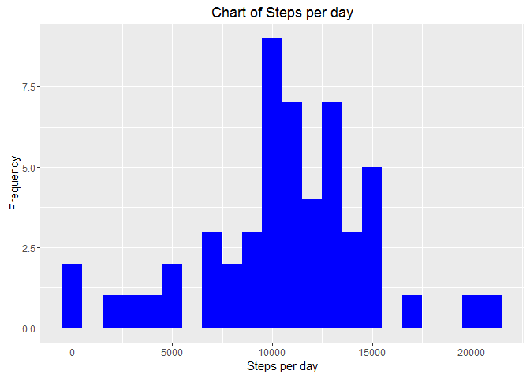
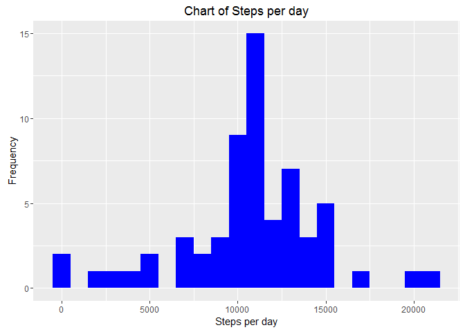

# Reproducible Research: Peer Assessment 1


## Loading and preprocessing the data
First we have to load and process the data


```r
library(lubridate)
```

```
## Warning: package 'lubridate' was built under R version 3.2.5
```

```
## 
## Attaching package: 'lubridate'
```

```
## The following object is masked from 'package:base':
## 
##     date
```

```r
data = read.csv("activity.csv",colClasses = c("numeric","character","integer"))

data$date = ymd(data$date)
str(data)
```

```
## 'data.frame':	17568 obs. of  3 variables:
##  $ steps   : num  NA NA NA NA NA NA NA NA NA NA ...
##  $ date    : Date, format: "2012-10-01" "2012-10-01" ...
##  $ interval: int  0 5 10 15 20 25 30 35 40 45 ...
```

```r
head(data)
```

```
##   steps       date interval
## 1    NA 2012-10-01        0
## 2    NA 2012-10-01        5
## 3    NA 2012-10-01       10
## 4    NA 2012-10-01       15
## 5    NA 2012-10-01       20
## 6    NA 2012-10-01       25
```


## What is mean total number of steps taken per day?
First we will find the number of steps per day.

```r
library(dplyr)
```

```
## Warning: package 'dplyr' was built under R version 3.2.4
```

```
## 
## Attaching package: 'dplyr'
```

```
## The following objects are masked from 'package:lubridate':
## 
##     intersect, setdiff, union
```

```
## The following objects are masked from 'package:stats':
## 
##     filter, lag
```

```
## The following objects are masked from 'package:base':
## 
##     intersect, setdiff, setequal, union
```

```r
steps <- data %>%
filter(!is.na(steps))%>%
group_by(date)%>%
summarize(steps=sum(steps))%>%
print
```

```
## Source: local data frame [53 x 2]
## 
##          date steps
##        (date) (dbl)
## 1  2012-10-02   126
## 2  2012-10-03 11352
## 3  2012-10-04 12116
## 4  2012-10-05 13294
## 5  2012-10-06 15420
## 6  2012-10-07 11015
## 7  2012-10-09 12811
## 8  2012-10-10  9900
## 9  2012-10-11 10304
## 10 2012-10-12 17382
## ..        ...   ...
```
Now we will create a histogram with this data

```r
library(ggplot2)
```

```
## Warning: package 'ggplot2' was built under R version 3.2.5
```

```r
ggplot(steps, aes(x = steps)) +
geom_histogram(fill = "blue", binwidth = 1000) +
labs(title = "Chart of Steps per day", x = "Steps per day", y = "Frequency")
```

<!-- -->
Lastly we will now calculate the mean and median of the steps per day

```r
meanSteps <- mean(steps$steps, na.rm = TRUE)
medianSteps <-median(steps$steps, na.rm = TRUE)
meanSteps
```

```
## [1] 10766.19
```

```r
medianSteps
```

```
## [1] 10765
```


## What is the average daily activity pattern?
Now we will create a time series plot of the 5 minute interval and the average number of steps taken average across all days

```r
interval <- data %>%
filter(!is.na(steps))%>%
group_by(interval) %>%
summarize(steps = mean(steps))
ggplot(interval, aes(x=interval, y=steps))+ geom_line(color = "blue")
```

<!-- -->
Now we will find the interval with the maximum number of steps.

```r
interval[which.max(interval$steps),]
```

```
## Source: local data frame [1 x 2]
## 
##   interval    steps
##      (int)    (dbl)
## 1      835 206.1698
```
So the interval is 835


## Imputing missing values
For the next part we will need to caclulate the total number of NA values

```r
sum(is.na(data$steps))
```

```
## [1] 2304
```
The next step is to fill in the NA values in a new data set with the average number of steps in the same interval

```r
new_data <- data
nas <- is.na(new_data$steps)
avg_interval <- tapply(new_data$steps, new_data$interval, mean, na.rm=TRUE, simplify=TRUE)
new_data$steps[nas] <- avg_interval[as.character(new_data$interval[nas])]
```
We need to create a histogram of the number of steps taken in each 5 minute interval and in order to do so we will need create another data set

```r
new_steps <- new_data %>%
  filter(!is.na(steps)) %>%
  group_by(date) %>%
  summarize(steps = sum(steps)) %>%
  print
```

```
## Source: local data frame [61 x 2]
## 
##          date    steps
##        (date)    (dbl)
## 1  2012-10-01 10766.19
## 2  2012-10-02   126.00
## 3  2012-10-03 11352.00
## 4  2012-10-04 12116.00
## 5  2012-10-05 13294.00
## 6  2012-10-06 15420.00
## 7  2012-10-07 11015.00
## 8  2012-10-08 10766.19
## 9  2012-10-09 12811.00
## 10 2012-10-10  9900.00
## ..        ...      ...
```

```r
ggplot(new_steps, aes(x = steps)) +
geom_histogram(fill = "blue", binwidth = 1000) +
labs(title = "Chart of Steps per day", x = "Steps per day", y = "Frequency")
```

<!-- -->
After creating the new histogram we will need the mean and median  steps

```r
mean_new_steps<- mean(new_steps$steps, na.rm = TRUE)
median_new_steps <- mean(new_steps$steps, na.rm = TRUE)
mean_new_steps
```

```
## [1] 10766.19
```

```r
median_new_steps
```

```
## [1] 10766.19
```
The mean and median are now equal to 10766.19 after the na values are filled in


## Are there differences in activity patterns between weekdays and weekends?
The last part requires us to create a new data set where we add a new column which tells us the weektype, if it is a weekday or weekend.

```r
new_data <- mutate(new_data, weektype = ifelse(weekdays(new_data$date) == "Saturday" | weekdays(new_data$date) == "Sunday", "weekend", "weekday"))
new_data$weektype <- as.factor(new_data$weektype)
head(new_data)
```

```
##       steps       date interval weektype
## 1 1.7169811 2012-10-01        0  weekday
## 2 0.3396226 2012-10-01        5  weekday
## 3 0.1320755 2012-10-01       10  weekday
## 4 0.1509434 2012-10-01       15  weekday
## 5 0.0754717 2012-10-01       20  weekday
## 6 2.0943396 2012-10-01       25  weekday
```
No we will create two time series plots comparing the steps with intervals during the weekdays vs the steps in the weekends.

```r
new_interval <- new_data %>%
group_by(interval, weektype) %>%
summarise(steps = mean(steps))
grph <- ggplot(new_interval, aes(x=interval, y=steps, color = weektype)) +
  geom_line() +
  facet_wrap(~weektype, ncol = 1, nrow=2)
print(grph)
```

<!-- -->
